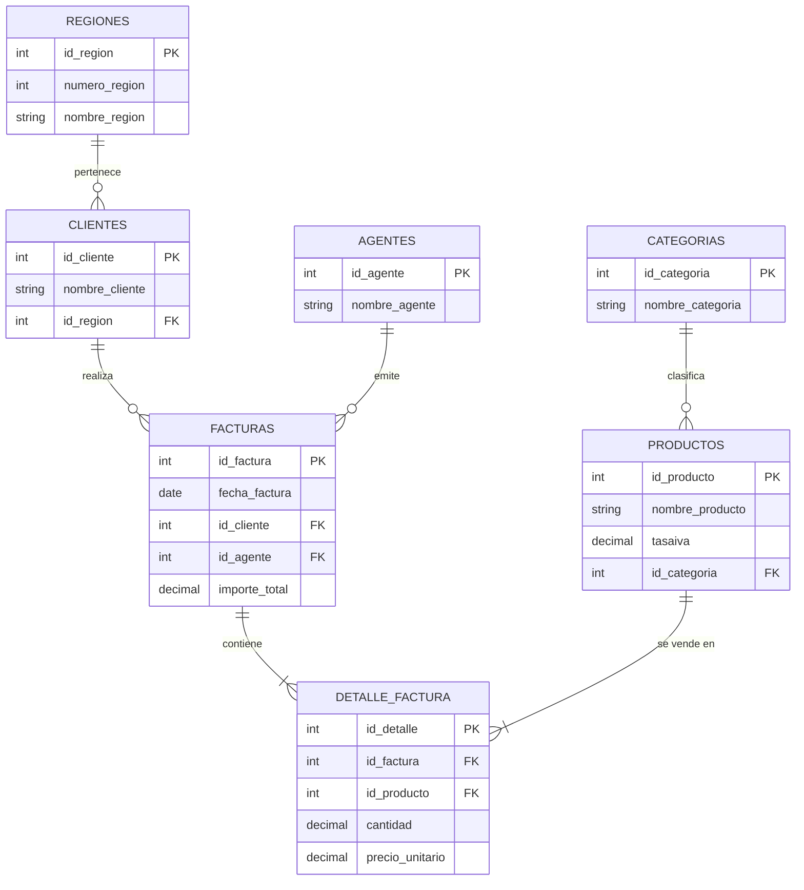

```mermaid
erDiagram
    REGIONES ||--o{ CLIENTES : "pertenece"
    CLIENTES ||--o{ FACTURAS : "realiza"
    AGENTES ||--o{ FACTURAS : "emite"
    FACTURAS ||--|{ DETALLE_FACTURA : "contiene"
    PRODUCTOS ||--|{ DETALLE_FACTURA : "se vende en"
    CATEGORIAS ||--o{ PRODUCTOS : "clasifica"

    REGIONES {
        int id_region PK
        int numero_region
        string nombre_region
    }

    CLIENTES {
        int id_cliente PK
        string nombre_cliente
        int id_region FK
    }

    AGENTES {
        int id_agente PK
        string nombre_agente
    }

    FACTURAS {
        int id_factura PK
        date fecha_factura
        int id_cliente FK
        int id_agente FK
        decimal importe_total
    }

    PRODUCTOS {
        int id_producto PK
        string nombre_producto
        decimal tasaiva
        int id_categoria FK
    }

    CATEGORIAS {
        int id_categoria PK
        string nombre_categoria
    }

    DETALLE_FACTURA {
        int id_detalle PK
        int id_factura FK
        int id_producto FK
        decimal cantidad
        decimal precio_unitario
    }
```
